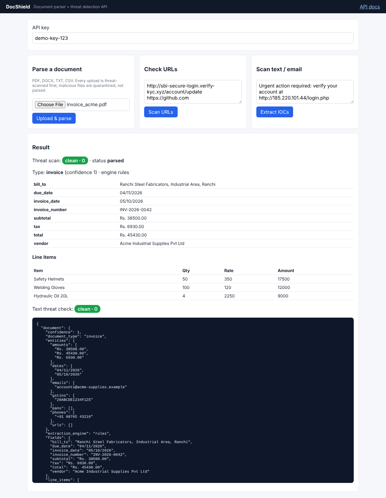

# DocShield: Automated Document Parser + Threat Detection API

A Flask REST API that turns business documents (invoices, purchase orders, receipts, resumes, contracts) into structured JSON, and **threat-scans every upload before it is parsed**. Also exposes standalone endpoints for file, URL and text/email threat checks that other apps can integrate.

> **Demo recreation.** An original, from-scratch build of the kind of "automated document parser and threat-detection API integration" I delivered as a freelance developer with ScubenAI. No client code or data is included; all samples are fictional.



## Features

**Document parsing**
- Text extraction from PDF, DOCX/DOCM, TXT, CSV, JSON
- Document classification (invoice, purchase order, receipt, resume, contract, generic)
- Field extraction: invoice/PO number, dates, vendor, bill-to, subtotal, tax, grand total
- Line-item table parsing and arithmetic validation (items + tax vs total)
- Entity extraction: emails, phones, GSTINs, dates, amounts, URLs; PAN numbers are masked
- Extractive summary
- Optional LLM refinement (OpenAI JSON mode) when `OPENAI_API_KEY` is set; rules-only otherwise

**Threat detection**
- MD5/SHA-1/SHA-256, Shannon entropy, known-bad hash list (EICAR included for testing)
- Executable magic bytes, dangerous and double extensions, extension/content mismatch
- PDF: `/JavaScript`, `/OpenAction`, `/Launch`, `/EmbeddedFile`, `/AA` and friends
- Office: VBA macros, remote template injection, executables inside archives, zip-bomb ratio
- URLs: raw IPs, punycode, `@` tricks, abused TLDs, shorteners, brand impersonation, executable downloads
- Text/email: IOC extraction (IPs, URLs, domains, hashes, emails, CVEs) and phishing-language signals
- Optional **VirusTotal v3** hash lookup (`VT_API_KEY`)
- Malicious uploads are **quarantined** and never parsed

**API hygiene**: API-key auth (constant-time compare), upload size cap, SQLite job store, security headers.

## Run locally

```bash
python -m venv .venv && source .venv/bin/activate
pip install -r requirements.txt
python wsgi.py                       # http://localhost:5003 (demo UI), /docs (API reference)
```

Default API key in demo mode: `demo-key-123`.

```bash
curl -H "X-API-Key: demo-key-123" -F file=@samples/invoice_acme.pdf http://localhost:5003/api/v1/documents
curl -H "X-API-Key: demo-key-123" -F file=@samples/suspicious_autorun.pdf http://localhost:5003/api/v1/threats/file
curl -H "X-API-Key: demo-key-123" -H "Content-Type: application/json" \
     -d "{\"text\": \"$(tr '\n' ' ' < samples/phishing_email.txt)\"}" http://localhost:5003/api/v1/threats/text
```

`samples/make_samples.py` regenerates the sample PDFs (a clean invoice and a harmless PDF with an auto-run JavaScript alert).

## Tests

```bash
pytest -q
```

## Deploy

- **Render**: *New > Blueprint* with this repo; set `API_KEYS` (and optional `OPENAI_API_KEY`, `VT_API_KEY`).
- **Docker**: `docker build -t docshield . && docker run -p 8000:8000 -e API_KEYS=my-secret docshield`

Set `API_KEYS` in any public deployment so the demo key is disabled.

## Limitations

Static analysis only: no sandbox detonation or OCR for scanned images. Treat verdicts as triage signals, not a replacement for an antivirus engine.

## Author and contributors

- **Sandeep Kashyap** ([@sktut](https://github.com/sktut)), author and maintainer
